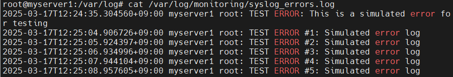
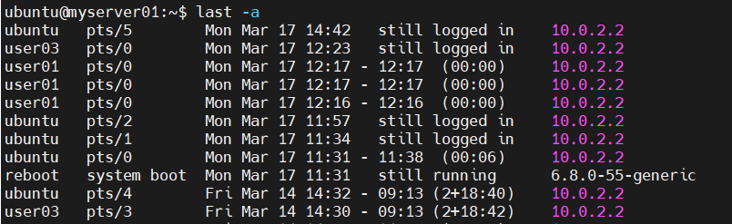
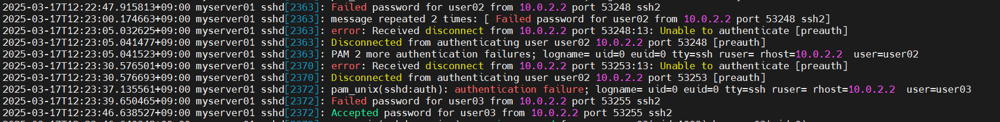
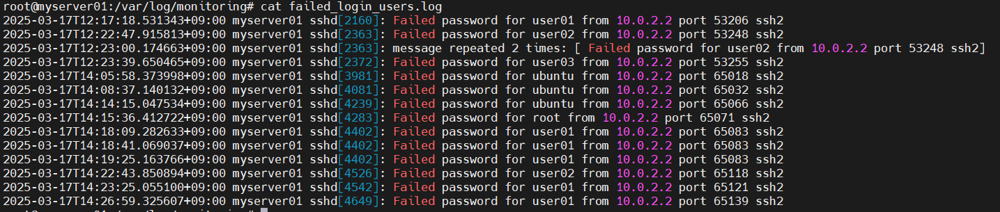

# Linux 환경에서 Crontab을 통해 환경 정보 수집하기 📊
<br>

## /var/log 디렉터리에 어떤 정보가 저장될까?

### 1. 시스템 관련 로그 🖥️
#### 1. `/var/log/syslog` 또는 `/var/log/messages`
- 일반적인 모든 시스템 이벤트를 기록하며, 서비스 상태, 부팅 과정, 커널 메시지, 네트워크 관련 메시지 등 포함
- Ubuntu/Debian 계열: /var/log/syslog
- RHEL/CentOS 계열: /var/log/messages

#### 2. `/var/log/dmesg`
- 부팅 시 커널 메시지를 기록하며, 하드웨어, 장치 드라이버, 시스템 부팅 과정에서 발생한 이벤트를 저장

#### 3. `/var/log/boot.log`
- 부팅 과정의 모든 이벤트를 기록

### 2. 사용자 및 인증 관련 로그
#### - `/var/log/auth.log` 또는 `/var/log/secure`
- 사용자 로그인, 인증 관련 이벤트가 기록되며, sudo 명령어 사용 내역, SSH 로그인 시도, 비밀번호 변경 등 보안과 관련된 활동 포함
- Ubuntu/Debian 계열: `/var/log/auth.log`
- RHEL/CentOS 계열: `/var/log/secure`

### 3. 패키지 및 업데이트 로그
#### - `/var/log/dpkg.log`, `/var/log/yum.log`
- 패키지 설치 및 삭제 로그 기록
- Ubuntu/Debian 계열: `/var/log/dpkg.log`
- RHEL/CentOS 계열: `/var/log/yum.log`

### 4. 네트워크 및 방화벽 로그
#### - `/var/log/kern.log`
- 커널에서 발생하는 모든 이벤트가 기록되며, 네트워크 인터페이스 문제, 드라이버 오류, 방화벽 관련 문제 등 확인 가능

### 5. Cron 작업 관련 로그
#### - `/var/log/cron.log`
- Cron 작업 실행 기록하며, Cron 실행 여부 및 오류 확인 가능

<br>

## 1. Error 로그 수집하기 ⚠️
### Syslog에서 Error 로그 확인하기 
#### 1. `/var/log/syslog` 로그에서 Error 로그 확인 🖥️
```
cat /var/log/syslog | grep "error"
```


#### 2. Monitor를 위한 Shell 작성 🔍
```
vi /usr/local/bin/log_monitor.sh
```
- 중복 내용 없이 안 읽은 부분에 대해서만 로그 읽어오기
```
#!/bin/bash
LOG_FILE="/var/log/syslog"
LOG_HISTORY="/var/log/monitoring/syslog_position"
LOG_OUTPUT="/var/log/monitoring/syslog_errors.log"

# 마지막으로 읽은 줄 번호 가져오기
LAST_LINE=$(cat "$LOG_HISTORY" 2>/dev/null || echo 0)

# 신규 로그 검색 후 저장
awk "NR>$LAST_LINE" "$LOG_FILE" | grep -i "ERROR" >> "$LOG_OUTPUT"

# 현재 로그 파일의 마지막 줄 번호 저장
wc -l < "$LOG_FILE" > "$LOG_HISTORY"

```

#### 3. Crontab 설정 🗓️

```
crontab -e

* * * * * /usr/local/bin/log_monitor.sh
```

#### 4. 확인을 위한 임의의 에러 로그 발생 🚨
```
logger -p user.err "TEST ERROR: This is a simulated error for testing"


for i in {1..5}; do logger -p user.err "TEST ERROR #$i: Simulated error log"; sleep 1; done
```
- `logger` : 사용자 정의 메세지를 로그에 기록

#### 5. 결과 확인 🔍



<br>

## 이상 접속 확인하기 🕵️‍♂️
### 1. 하루에 10번 로그인한 사용자 확인하기 🖥️
#### 1. **`/var/log/wtmp`** 로그에서 로그인 사용자 정보 확인 📝
- **`last`** 명령어는 /var/log/wtmp에서 데이터를 가져와 시스템에 로그인한 사용자 목록을 출력
- **`-a`** : IP 또는 호스트 정보도 같이 출력 


#### 2. Crontab 설정 🗓️
    ```
    crontab -e
    
    */5 * * * * last -a | awk '{print $1}' | sort | uniq -c | awk '$1 >= 10 {print $2}' >> /var/log/monitoring/multiple_login_users.log
    ```
- **`awk '{print $1}'`** : **`awk`**를 사용하여 첫번째 필드인 사용자 명만 추출 
    ```
    root
    ubuntu
    ubuntu
    ubuntu
    ```
- **`sort`** : 사용자명 정렬
- **`uniq -c`** : 동일한 사용자명을 그룹화하고 카운트 
    ```
    1 root
    10 ubuntu
    ```
- **`awk '$1 >= 10 {print $2}'`** : 로그인 횟수가 10회 이상인 사용자만 출력 
    ```
    ubuntu
    ```
- **`>> /var/log/monitoring/multiple_login_users.log`** : 결과를 **`/var/log/monitoring/multiple_login_users.log`** 파일에 저장
- **`*/5 * * * *`** : 5분마다 로그인 횟수가 10회 이상인 사용자들의 목록을 이 파일에 기록

#### 3. 결과 확인 🔍

- **`last`** 명령어는 **`/var/log/wtmp`**에서 데이터를 가져오는데 wtmp 파일에는 시스템이 재부팅된 기록로 포함되기 때문에 reboot가 같이 출력 
- **`grep -v reboot`**를 추가하면 reboot 필터링 가능 

### 2. 로그인 실패한 사용자 출력 -> Brute Force Attack
#### 1. `/var/log/auth.log`에서 로그인 실패 로그 확인하기 
- 리눅스 시스템에서 인증 관련 로그를 저장하는 파일로, 사용자가 시스템에 로그인하려고 시도할 때마다 로그인 성공/실패 여부가 기록
- **`Failed password`**: SSH 로그인 실패 시 기록되는 메시지


#### 2. Crontab 설정 🗓️
    ```
    crontab -e

    * * * * * grep -a 'Failed password' /var/log/auth.log >> /var/log/monitoring/failed_login_users.log

    ```
- **`grep -a 'Failed password' /var/log/auth.log`** : **`/var/log/auth.log`에서 `"Failed password"`** 문자열을 포함 여부검색 
- **`>> /var/log/monitoring/failed_login_users.log`** : 검색된 결과를 **`/var/log/monitoring/failed_login_users.log`** 파일에 저장

#### 3. 결과 확인 🔍


<br>

## CPU USAGE 정보 수집하기 🖥️
### CPU 사용량 80% 이상인 로그 확인하기 ⚡
#### 1. `top` 명령어로 cpu 및 메모리 확인 🖥️
   <br>

   

#### 2. Crontab 설정 🗓️
- 1분 마다 cpu 사용량 총 합이 80% 이상일 경우 **`top`** 명령어 실행 결과를 `/var/log/cpu_usage.log`에 저장하여 cpu 및 메모리 사용 내역 확인 가능
   ```
   */1 * * * * cpu_usage=$(top -bn1 | grep "Cpu(s)" | sed "s/.*, *\([0-9.]*\)%* id.*/\1/" | awk '{print 100 - $1}') && if (( $(echo "$cpu_usage >= 80" | bc -l) )); then echo "$(date) - CPU Usage: $cpu_usage%" >> /var/log/cpu_usage.log;
   ```
    - `grep "Cpu(s)" | sed "s/.*, *\([0-9.]*\)%* id.*/\1/" | awk '{print 100 - $1}') && if (( $(echo "$cpu_usage >= 80" | bc -l) ))`
       : cpu 사용률이 80 이상인 로그 검색
    - `>> /var/log/cpu_usage.log`
       : 결과를 cpu_usage.log에 저장
      <br>
#### 3. 결과 확인 🔍
       
