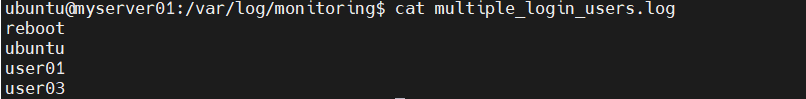

# Linux 환경에서 Crontab을 통해 환경 정보 수집하기

- ## /var/log 디렉터리에 어떤 정보가 저장될까?

### CentOS

- /var/log/message - 다음을 제외한 모든 syslog 메시지

- /var/log/secure - 보안 및 인증 관련 메시지 및 오류

- /var/log/maillog - 메일 서버 관련 메시지 및 오류

- /var/log/cron - 주기적으로 실행한 작업과 관련된 로그 파일

- /var/log/boot.log - 시스템 시작과 관련된 로그 파일

### Ubuntu

- /var/log/syslog - 일반적인 시스템 로그

- /var/log/auth.log - 인증 및 보안 관련 로그


## Error 로그 수집하기
- syslog에서 error 확인해보기
```
cat /var/log/syslog | grep "error"
```
- monitor를 위해 shell 작성
```
vi /usr/local/bin/log_monitor.sh
```
- 중복 내용 없이 안 읽은 부불에 대해서만 로그 읽어오기
```
#!/bin/bash
LOG_FILE="/var/log/syslog"
LOG_HISTORY="/var/log/monitoring/syslog_position"
LOG_OUTPUT="/var/log/monitoring/syslog_errors.log"

# 마지막으로 읽은 줄 번호 가져오기
LAST_LINE=$(cat "$LOG_HISTORY" 2>/dev/null || echo 0)

# 신규 로그 검색 후 저장
awk "NR>$LAST_LINE" "$LOG_FILE" | grep -i "ERROR" >> "$LOG_OUTPUT"

# 현재 로그 파일의 마지막 줄 번호 저장
wc -l < "$LOG_FILE" > "$LOG_HISTORY"

```

- 1분마다 로그 기록 수집

```
crontab -e

* * * * * /usr/local/bin/log_monitor.sh
```

- 에러 로그 생성하기
```
logger -p user.err "TEST ERROR: This is a simulated error for testing"


for i in {1..5}; do logger -p user.err "TEST ERROR #$i: Simulated error log"; sleep 1; done
```
- 결과 화면


## 이상 접속 확인하기 
### 1. 하루에 10번 로그인한 사용자 확인 
1. last 명령어 : /var/log/wtmp 로그 
- 시스템에 로그이한 사용자 목록을 출력
- -a : IP 또는 호스트 정보도 같이 출력 


2. crontab 설정 
    ```
    crontab -e

    */5 * * * * last -a | awk '{print $1}' | sort | uniq -c | awk '$1 >= 10 {print $2}' >> /var/log/monitoring/multiple_login_users.log


    ```
- `awk '{print $1}'` : `awk`를 사용하여 첫번째 필드인 사용자 명만 추출 
    ```
    root
    ubuntu
    ubuntu
    ubuntu
    ```
- `sort` : 사용자명 정렬
- `uniq -c` : 동일한 사용자명을 그룹화하고 카운트 
    ```
    1 root
    10 ubuntu
    ```
- `awk '$1 >= 10 {print $2}'` : 로그인 횟수가 10회 이상인 사용자만 출력 
    ```
    ubuntu
    ```
- `>> /var/log/monitoring/multiple_login_users.log` : 결과를 /var/log/monitoring/multiple_login_users.log 파일에 저장
- */5 * * * * : 5분마다 로그인 횟수가 10회 이상인 사용자들의 목록을 이 파일에 기록

3. 저장된 로그 확인 

- last 명령어어는 /var/log/wtmp에서 데이터를 가져오는데 wtmp 파일에는 시스템이 재부팅된 기록로 포함되기 때문에 reboot가 가치 출력 
- `grep -v reboot`를 추가하면 reboot 필터링 가능 

### 2. 로그인 실패한 사용자 출력 -> Brute Force Attack
1. /var/log/auth.log
- 리눅스 시스템에서 인증 관련 로그를 저장하는 파일로, 사용자가 시스템에 로그인하려고 시도할 때마다 로그인 성공/실패 여부가 기록
- `Failed password` : SSH 로그인 실패 시 기록되는 메시지


2. crontab 설정 
    ```
    crontab -e

    * * * * * grep -a 'Failed password' /var/log/auth.log >> /var/log/monitoring/failed_login_users.log

    ```
    - grep -a 'Failed password' /var/log/auth.log : `/var/log/auth.log`에서 `"Failed password"` 문자열을 포함 여부검색 
    - `>> /var/log/monitoring/failed_login_users.log` : 검색된 결과를 /var/log/monitoring/failed_login_users.log 파일에 저장

3. 저장된 로그 확인 

## CPU USAGE 정보 수집하기
### CPU 사용량 80% 이상인 로그 확인하기
1. top 명령어로 cpu 및 메모리 확인
   <br>

   

2. cron 설정
       1분 마다 cpu 사용량 총 합이 80% 이상일 경우 top 명령어 실행 결과를 /var/log/cpu_usage.log에 저장하여 cpu 및 메모리 사용 내역 확인 가능
   ```
   */1 * * * * cpu_usage=$(top -bn1 | grep "Cpu(s)" | sed "s/.*, *\([0-9.]*\)%* id.*/\1/" | awk '{print 100 - $1}') && if (( $(echo "$cpu_usage >= 80" | bc -l) )); then echo "$(date) - CPU Usage: $cpu_usage%" >> /var/log/cpu_usage.log;
   ```
    - `grep "Cpu(s)" | sed "s/.*, *\([0-9.]*\)%* id.*/\1/" | awk '{print 100 - $1}') && if (( $(echo "$cpu_usage >= 80" | bc -l) ))`
       : cpu 사용률이 80 이상인 로그 검색
    - `>> /var/log/cpu_usage.log`
       : 결과를 cpu_usage.log에 저장
      <br>
3. 결과 확인
    <br>
       
